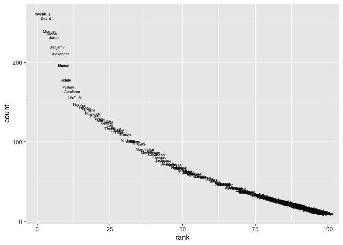

p8105\_hw2\_ng2696
================
Nihan Gencerliler
10/2/2019

# Homework 2

``` r
library(readxl)
library (ggplot2)
library(tidyverse)
```

    ## ── Attaching packages ───────────────────────────────────────────────────────────────── tidyverse 1.2.1 ──

    ## ✔ tibble  2.1.3     ✔ purrr   0.3.2
    ## ✔ tidyr   1.0.0     ✔ dplyr   0.8.3
    ## ✔ readr   1.3.1     ✔ stringr 1.4.0
    ## ✔ tibble  2.1.3     ✔ forcats 0.4.0

    ## ── Conflicts ──────────────────────────────────────────────────────────────────── tidyverse_conflicts() ──
    ## ✖ dplyr::filter() masks stats::filter()
    ## ✖ dplyr::lag()    masks stats::lag()

## Problem 1

Read and clean Mr Trash Wheel
sheet:

``` r
mr_trash_wheel = read_excel("./p8105_hw2_ng2696_files/Trash-Wheel-Collection-Totals-8-6-19.xlsx",sheet="Mr. Trash Wheel", range="A2:N406") %>%
  janitor::clean_names() %>%
  drop_na() %>%
  mutate(sports_balls_integer=as.integer(sports_balls))
```

Read and clean sheets with aggregate monthly data for 2017 and
2018:

``` r
mr_trash_wheel_2017 = read_excel("./p8105_hw2_ng2696_files/Trash-Wheel-Collection-Totals-8-6-19.xlsx",sheet="2017 Precipitation",range="A2:B14") %>%
  mutate(year=2017)
mr_trash_wheel_2018 = read_excel("./p8105_hw2_ng2696_files/Trash-Wheel-Collection-Totals-8-6-19.xlsx",sheet="2018 Precipitation",range="A2:B14") %>%
  mutate(year=2018)
mr_trash_wheel_monthly = 
  bind_rows(mr_trash_wheel_2017,mr_trash_wheel_2018)%>%
  janitor::clean_names() %>%
  mutate(month=month.name[month])
```

Exploring the two datasets:

``` r
dim(mr_trash_wheel)
```

    ## [1] 344  15

``` r
head(mr_trash_wheel)
```

    ## # A tibble: 6 x 15
    ##   dumpster month  year date                weight_tons volume_cubic_ya…
    ##      <dbl> <chr> <dbl> <dttm>                    <dbl>            <dbl>
    ## 1        1 May    2014 2014-05-16 00:00:00        4.31               18
    ## 2        2 May    2014 2014-05-16 00:00:00        2.74               13
    ## 3        3 May    2014 2014-05-16 00:00:00        3.45               15
    ## 4        4 May    2014 2014-05-17 00:00:00        3.1                15
    ## 5        5 May    2014 2014-05-17 00:00:00        4.06               18
    ## 6        6 May    2014 2014-05-20 00:00:00        2.71               13
    ## # … with 9 more variables: plastic_bottles <dbl>, polystyrene <dbl>,
    ## #   cigarette_butts <dbl>, glass_bottles <dbl>, grocery_bags <dbl>,
    ## #   chip_bags <dbl>, sports_balls <dbl>, homes_powered <dbl>,
    ## #   sports_balls_integer <int>

``` r
group_by(mr_trash_wheel,year) %>%
summarize(median_sport_balls=median(sports_balls,na.rm=FALSE))
```

    ## # A tibble: 6 x 2
    ##    year median_sport_balls
    ##   <dbl>              <dbl>
    ## 1  2014                6  
    ## 2  2015               16  
    ## 3  2016               26  
    ## 4  2017                8  
    ## 5  2018                4  
    ## 6  2019                8.5

``` r
head(mr_trash_wheel_monthly)
```

    ## # A tibble: 6 x 3
    ##   month    total  year
    ##   <chr>    <dbl> <dbl>
    ## 1 January   2.34  2017
    ## 2 February  1.46  2017
    ## 3 March     3.57  2017
    ## 4 April     3.99  2017
    ## 5 May       5.64  2017
    ## 6 June      1.4   2017

``` r
dim(mr_trash_wheel_monthly)
```

    ## [1] 24  3

``` r
group_by(mr_trash_wheel_monthly,year) %>%
summarize(total_rain=sum(total,na.rm=FALSE))
```

    ## # A tibble: 2 x 2
    ##    year total_rain
    ##   <dbl>      <dbl>
    ## 1  2017       32.9
    ## 2  2018       70.3

There are 344 observations and 15 variables in mr\_trash\_wheel. Some
key variables are dumpster number,the year in which the data was
collected, and the weight of the trash in tons. The median number of
sports balls in 2017 was 8. There are 24 observations and three
variables in mr\_trash\_wheel\_monthly. The total precipitation in 2018
was 70.33 tons.

## Problem 2

Read and clean
pols\_month:

``` r
pols_month=read_csv("./p8105_hw2_ng2696_files/fivethirtyeight_datasets/pols-month.csv") %>%
separate(mon,c("year","month","day"),"-") %>%
  mutate(month=month.name[as.integer(month)]) %>%
  mutate(president=recode(prez_dem, `1` = "dem", `0` = "gop")) %>%
  select(-prez_dem,-prez_gop,-day)
```

    ## Parsed with column specification:
    ## cols(
    ##   mon = col_date(format = ""),
    ##   prez_gop = col_double(),
    ##   gov_gop = col_double(),
    ##   sen_gop = col_double(),
    ##   rep_gop = col_double(),
    ##   prez_dem = col_double(),
    ##   gov_dem = col_double(),
    ##   sen_dem = col_double(),
    ##   rep_dem = col_double()
    ## )

Read and clean
snp:

``` r
snp=read_csv("./p8105_hw2_ng2696_files/fivethirtyeight_datasets/snp.csv") %>%
separate(date,c("month","day","year"),"/") %>%
  mutate(month_integer=as.integer(month),month=month.name[month_integer]) %>%
  arrange(year, month_integer) %>%
  select(year, month, close, -day, -month_integer) 
```

    ## Parsed with column specification:
    ## cols(
    ##   date = col_character(),
    ##   close = col_double()
    ## )

Read and clean
unemployment:

``` r
unemployment=read_csv("./p8105_hw2_ng2696_files/fivethirtyeight_datasets/unemployment.csv") %>%
  pivot_longer(Jan:Dec,
               names_to="month",
               values_to="percent_unemployed") %>%
    mutate(month=recode(month, `Jan` = "January", `Feb` = "February",`Mar` = "March",`Apr` = "April",`May` = "May",`Jun` = "June",`Jul` = "July",`Aug` = "August",`Sep` = "September",`Oct` = "October",`Nov` = "November", `Dec`="December")) %>%
    janitor::clean_names() 
```

    ## Parsed with column specification:
    ## cols(
    ##   Year = col_double(),
    ##   Jan = col_double(),
    ##   Feb = col_double(),
    ##   Mar = col_double(),
    ##   Apr = col_double(),
    ##   May = col_double(),
    ##   Jun = col_double(),
    ##   Jul = col_double(),
    ##   Aug = col_double(),
    ##   Sep = col_double(),
    ##   Oct = col_double(),
    ##   Nov = col_double(),
    ##   Dec = col_double()
    ## )

Merge snp and pols\_month:

``` r
snp_pols_month=
left_join(snp, pols_month, by=c("year","month")) %>%
  mutate(year=as.integer(year))
```

Merge above dataset with unemployment:

``` r
snp_pols_unemployment=
left_join(snp_pols_month, unemployment, by=c("year","month"))
head(snp_pols_unemployment) 
```

    ## # A tibble: 6 x 11
    ##    year month close gov_gop sen_gop rep_gop gov_dem sen_dem rep_dem
    ##   <dbl> <chr> <dbl>   <dbl>   <dbl>   <dbl>   <dbl>   <dbl>   <dbl>
    ## 1  1950 Janu…  17.0      18      44     177      29      57     269
    ## 2  1950 Febr…  17.2      18      44     177      29      57     269
    ## 3  1950 March  17.3      18      44     177      29      57     269
    ## 4  1950 April  18.0      18      44     177      29      57     269
    ## 5  1950 May    18.8      18      44     177      29      57     269
    ## 6  1950 June   17.7      18      44     177      29      57     269
    ## # … with 2 more variables: president <chr>, percent_unemployed <dbl>

``` r
dim(snp_pols_unemployment)
```

    ## [1] 787  11

``` r
min(snp_pols_month$year)
```

    ## [1] 1950

``` r
max(snp_pols_month$year)
```

    ## [1] 2015

The pols\_month dataset contained monthly data on the number of elected
officials of a given political party from the year 1950 to 2015. The snp
dataset contained monthly data onthe closing values of the S\&P stock
index. The unemployment dataset contained monthly data on the percentage
of the population that is unemployed. Once we merged these data, the
resulting data set has 787 observations and 11 variables including
unemployed, close, and president, which indicates whether a Republican
or Democrat was in that office in that month. Each observation is a
month between the years 1950 to 2015.

## Problem 3

Read and clean
dataset:

``` r
baby_names = read_csv("./p8105_hw2_ng2696_files/Popular_Baby_Names.csv") %>%
  janitor::clean_names() %>%
  distinct() %>%
  mutate(ethnicity=recode(ethnicity,`ASIAN AND PACIFIC ISLANDER` = "Asian and Pacific Islander", `BLACK NON HISPANIC` = "Black Non-hispanic",`HISPANIC` = "Hispanic", `WHITE NON HISPANIC` = "White Non-hispanic",`ASIAN AND PACI` = "Asian and Pacific Islander", `BLACK NON HISP` = "Black Non-hispanic",`WHITE NON HISP` = "White Non-hispanic"),gender=recode(gender, `FEMALE` = "Female", `MALE` = "Male"),childs_first_name=str_to_title(childs_first_name))
```

    ## Parsed with column specification:
    ## cols(
    ##   `Year of Birth` = col_double(),
    ##   Gender = col_character(),
    ##   Ethnicity = col_character(),
    ##   `Child's First Name` = col_character(),
    ##   Count = col_double(),
    ##   Rank = col_double()
    ## )

``` r
#using unique to check categorical predictors
unique(pull(baby_names,ethnicity))
```

    ## [1] "Asian and Pacific Islander" "Black Non-hispanic"        
    ## [3] "Hispanic"                   "White Non-hispanic"

``` r
unique(pull(baby_names,gender))
```

    ## [1] "Female" "Male"

Create table showing popularity of Olivia only:

``` r
olivia=
  filter(baby_names,childs_first_name=="Olivia") %>%
  mutate(rank=as.integer(rank))%>%
  pivot_wider(names_from="year_of_birth", values_from="rank") %>%
  select(-gender,-count,-childs_first_name) %>%
  group_by(ethnicity) %>%
  summarise_each(funs(na.omit))
```

    ## Warning: funs() is soft deprecated as of dplyr 0.8.0
    ## Please use a list of either functions or lambdas: 
    ## 
    ##   # Simple named list: 
    ##   list(mean = mean, median = median)
    ## 
    ##   # Auto named with `tibble::lst()`: 
    ##   tibble::lst(mean, median)
    ## 
    ##   # Using lambdas
    ##   list(~ mean(., trim = .2), ~ median(., na.rm = TRUE))
    ## This warning is displayed once per session.

``` r
knitr::kable(olivia)
```

| ethnicity                  | 2016 | 2015 | 2014 | 2013 | 2012 | 2011 |
| :------------------------- | ---: | ---: | ---: | ---: | ---: | ---: |
| Asian and Pacific Islander |    1 |    1 |    1 |    3 |    3 |    4 |
| Black Non-hispanic         |    8 |    4 |    8 |    6 |    8 |   10 |
| Hispanic                   |   13 |   16 |   16 |   22 |   22 |   18 |
| White Non-hispanic         |    1 |    1 |    1 |    1 |    4 |    2 |

Create table of most popular male names:

``` r
males=
  filter(baby_names,gender=="Male",rank==1) %>%
  mutate(year_of_birth=as.factor(year_of_birth))%>%
  pivot_wider(names_from="year_of_birth", values_from="childs_first_name") %>%
  select(-gender,-count,-rank)%>% group_by(ethnicity) %>%
  summarise_each(funs(na.omit))  

knitr::kable(males)
```

| ethnicity                  | 2016   | 2015   | 2014   | 2013   | 2012   | 2011    |
| :------------------------- | :----- | :----- | :----- | :----- | :----- | :------ |
| Asian and Pacific Islander | Ethan  | Jayden | Jayden | Jayden | Ryan   | Ethan   |
| Black Non-hispanic         | Noah   | Noah   | Ethan  | Ethan  | Jayden | Jayden  |
| Hispanic                   | Liam   | Liam   | Liam   | Jayden | Jayden | Jayden  |
| White Non-hispanic         | Joseph | David  | Joseph | David  | Joseph | Michael |

Scatterplot of male names:

``` r
males_plot=
  filter(baby_names,gender=="Male",year_of_birth==2016,ethnicity=="White Non-hispanic")
ggplot(males_plot,aes(x=rank,y=count)) + geom_text(aes(label=childs_first_name), size=2)
```

<!-- -->
